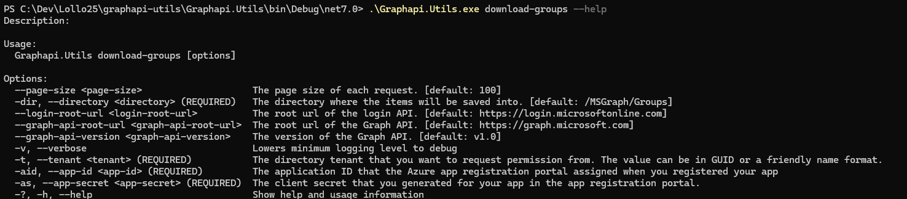

# GraphAPI utils

This is a CLI able to save locally groops taken from Microsoft Graph API.

# How to run

The CLi interface guides the user in setting the options in order to make the application work.

For example, to have the helper for the `download-groups` command you should run in powershell

```ps
.\Graphapi.Utils.exe "download-groups" --help
```

or in bash

```bash
./Graphapi.Utils "download-groups" --help
```

and you will have this output


The following command will do the job with default options:

```bash
./Graphapi.Utils  download-groups -t {Tenant ID} -aid {App ID} -as {Secret}
```

## Assumptions

- It is a CLI that starts, execute a command and dies; therefore:
  - CommandLine package is used to ease the usage of the CLI
  - A mechanism of auto refresh of the access token is not implemented
  - If the login fails it is logged but there is no retry since the user can simly re-run the CLI

## Limitations

- Groups are all kept in memory before the saving for the sake of simplicity, therefore this might cause high memory allocation in case of a large number of groups. If this case must be covered, the application should save each page as soon as it is retrieved.
- Group model is phisically mapped into c# class for the sake of simplicity. An automatic mapper using Source Generators would be more flexible and solid.
